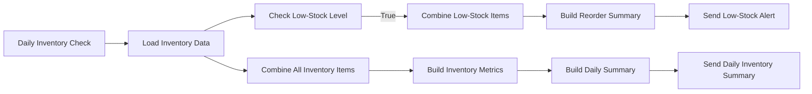

# Inventory & Low-Stock Business Automation

A portfolio-ready **n8n inventory monitoring workflow** that reads inventory data from Google Sheets, detects low-stock items using configurable reorder thresholds, generates a consolidated reorder list, and sends automated HTML email alerts and daily inventory summaries.

> This project is an **inventory monitoring automation**, not a full POS or stock transaction management system. Staff still update the current stock values in the inventory source; n8n handles monitoring, detection, reporting, and alerts.


## Business Problem

Small businesses often track inventory in spreadsheets but still have to manually scan rows to identify items that need replenishment. This creates repetitive work and increases the chance of overlooking low-stock items.

This workflow automates that monitoring layer while keeping the inventory source simple and familiar.

## What the Automation Does

- Runs automatically on a schedule.
- Reads all inventory rows from Google Sheets.
- Compares `current_stock` against `reorder_level` for every item.
- Routes low-stock items using an IF condition.
- Combines all low-stock records into one reorder list.
- Sends one consolidated HTML low-stock alert instead of one email per item.
- Calculates total, low-stock, and healthy-stock metrics.
- Sends a separate HTML daily inventory summary.
- Handles the **zero low-stock** scenario without sending an unnecessary low-stock alert.

## Workflow Architecture



### Low-stock rule

```text
current_stock <= reorder_level
```

If the condition is true, the item is included in the reorder alert.

## Screenshots

### Inventory source


### Low-stock condition


### Low-stock alert


### Daily inventory summary


## Inventory Data Structure

The workflow expects these columns:

| Column | Purpose |
| --- | --- |
| `item_id` | Unique inventory identifier |
| `item_name` | Human-readable item name |
| `category` | Inventory category |
| `current_stock` | Current quantity available |
| `unit` | Unit of measurement |
| `reorder_level` | Threshold that triggers low-stock status |
| `reorder_quantity` | Suggested replenishment quantity |
| `supplier` | Supplier or source |

A ready-to-use sample is included at [`sample-data/inventory-sample.csv`](sample-data/inventory-sample.csv).

## How a Client Uses It

The client does **not** need to work inside n8n during normal day-to-day use.

1. Staff update `current_stock` in the inventory spreadsheet.
2. The scheduled n8n workflow reads the latest values.
3. Items at or below their reorder level are identified automatically.
4. Management receives the low-stock reorder alert and daily summary by email.

Example:

```text
Coffee Beans
Current stock: 8 bags
Reorder level: 10 bags

8 <= 10  ->  LOW STOCK
```

## Tested Scenarios

### Low-stock scenario

Sample inventory result:

```text
Total items: 10
Low-stock items: 7
Healthy-stock items: 3
```

The workflow generated one consolidated reorder alert and one daily summary.

### Zero low-stock scenario

The workflow was also tested with all inventory quantities above their reorder levels:

```text
Total items: 10
Low-stock items: 0
Healthy-stock items: 10
```

Expected behavior was verified:

- No low-stock alert was sent.
- The daily summary still ran.
- The summary displayed `No low-stock items detected.`

## Tech Stack

- **n8n** — workflow automation
- **Google Sheets** — inventory data source
- **Gmail** — automated email delivery
- **n8n expressions / JavaScript expressions** — filtering, counting, formatting, and HTML generation

## Setup

### 1. Prepare Google Sheets

Create a spreadsheet with an `Inventory` sheet and the required columns shown above. You can import [`sample-data/inventory-sample.csv`](sample-data/inventory-sample.csv) as a starting point.

### 2. Import the workflow

Import:

[`workflow/inventory-low-stock-automation.json`](workflow/inventory-low-stock-automation.json)

into your n8n instance.

### 3. Connect credentials

Configure your own credentials in n8n for:

- Google Sheets
- Gmail

The public workflow file intentionally contains **no OAuth credential IDs**.

### 4. Configure the Google Sheet

Open the `Load Inventory Data` node and select your spreadsheet and `Inventory` sheet.

The public workflow uses a placeholder instead of the original spreadsheet ID.

### 5. Configure email recipients

Open both Gmail nodes and replace:

```text
YOUR_EMAIL@example.com
```

with the desired recipient address.

### 6. Review schedule and timezone

The sample workflow is configured for a daily run at **2:00 PM** and uses the **Asia/Manila** timezone. Adjust both settings for the target business.

### 7. Test before activation

Test at least these two cases before publishing the workflow:

- One or more items at/below reorder level.
- All items above reorder level.

Then activate/publish the workflow in n8n.

## Security & Privacy

The workflow in this repository is a **sanitized public export**. The following were removed or replaced before publishing:

- Google OAuth credential references
- Gmail OAuth credential references
- Original Google Sheet ID and URLs
- Personal recipient email addresses
- n8n webhook identifiers
- n8n instance metadata

Never commit private OAuth tokens, API keys, credentials, private spreadsheet links, or real customer inventory data to a public repository.

## Limitations

This version monitors inventory but does not automatically deduct or add stock when a sale, usage event, or supplier delivery occurs. `current_stock` is expected to be maintained by staff or another system.

## Possible Future Enhancements

- Stock IN / Stock OUT transaction form
- Automatic stock updates from transactions
- Transaction history / audit log
- Supplier-specific reorder emails
- Slack or Microsoft Teams alerts
- Weekly inventory reports
- Inventory dashboard
- POS or e-commerce integration
